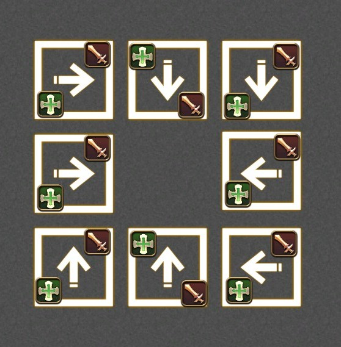

# Dawntrail Savage Raids

Mit Plan M9-12: https://docs.google.com/spreadsheets/d/1Pf2skmZvjjW-_lA5wwS8U0wHny5txsvRjPPw_4kg9cY/edit?gid=1402650805#gid=1402650805

## M9

https://raidplan.io/plan/c2L5iJfuYIWXk1v7

## M10

Plans:
- awet + nomnom + parallel aerial = hector
- awet: https://raidplan.io/plan/syjvfhacdxz7awet
- nomnom: https://raidplan.io/plan/Cmo_RpCDbsUSMV5c

Videos:
- Hector: https://www.youtube.com/watch?v=17J1p4f2rIw

Tips:

Double Alley-oop 1

- The spread and stack aoes targeted on the blue players do no damage to red players. It's safe to be near them.
- Tanks can survive standing in the fire.
- Cutback is a ~340 degree cone targeted on the FURTHEST fire player. If you know this and are willing to drop uptime, you can force the safe spot to be anywhere you want even if the party is not disciplined about stacking to bait cutback. I personally run far south to put the safe zone north, then gapclose back to the boss. As you can see, if done properly the boss does not move out of melee range and you can reliably avoid creating a sea of fire.
- To prevent the blue boss moving far out of the middle (which may cause its TB to land on the party), you can provoke the blue boss off your cotank. The bosses don't auto a lot in this phase so it is safe.

## M11

Plans:
- USB: https://raidplan.io/plan/HJAbE7fuWodELUSB
- WDZ (static arena split): https://raidplan.io/plan/ZSaq60muZdIfJWdZ
- 3CJ (fixed stampede): https://raidplan.io/plan/KXVlSGwV3zqON3CJ

Videos:

- Orbital Omen Braindead Solve: https://www.youtube.com/watch?v=KIQQdaD4OMA

## M12

### Phase 1

Plans:
- NNN: https://raidplan.io/plan/44JJjqZ6Mcgaxnnn

Tips:

Platforms cheat sheet

showing all possible growth directions and where to go

Videos:

- Hector: https://www.youtube.com/watch?v=VTzndDkiXEk
- Spreekatze: https://www.youtube.com/watch?v=7cn1iKmvPLE

### Phase 2

Plans:
- Replication 1 (static): https://raidplan.io/plan/3g95apsey4t987bz
- Replication 2: https://raidplan.io/plan/SFa6J6wDrU9PlCJ4
- Candies: https://raidplan.io/plan/tr2jrddp4hkebxc9
- Idyllic Dream: https://raidplan.io/plan/9zpa6vu5kxgtuwqc

Videos:
- Hector: https://www.youtube.com/watch?v=Osd---W8ZTY
- Spreekatze: https://www.youtube.com/watch?v=Bf6ck7W1FBI

Tools:
- Idyllic Dream Trainer: https://codepen.io/SneakyBear/full/QwEgWxe
- Raidsim: https://susybakaaa.itch.io/raidsim